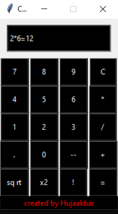
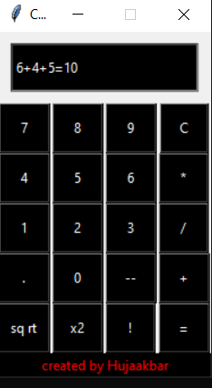

# A Calculator Project

## A calculator app built with tKinter created in 2020 April

_The App was built with sole purpose of **practising python and tKinter**._

---

### Features

- Once the equal sign is clicked, it displays the whole equation including the equal sign.

  > eg. 2\*6=12

    
  

   

- It calculates only one operation at a time, i.e. it cannot handle complex expressions:

  - If an expression includes the same operations such as `6+4+5` the app calculates only the first addition and gives the result while ignoring the second operation, (result = `10`).
   
   
  

    

  - If an expression includes different operations such as `3+8:2` the app throws an error.

- In order to calculate complex expressions, the equal sign should be clicked after every operation, then the next operation should be chained.
  _When chaining the operations, the app displays only a result of the last calculation._
  > eg. `(3+4)*7` is calculated in a following way:
  > 3+4= ➡️ 3+4=7 ➡️ \* ➡️ 7\* ➡️ 7\*4= ➡️ 7\*4=28
